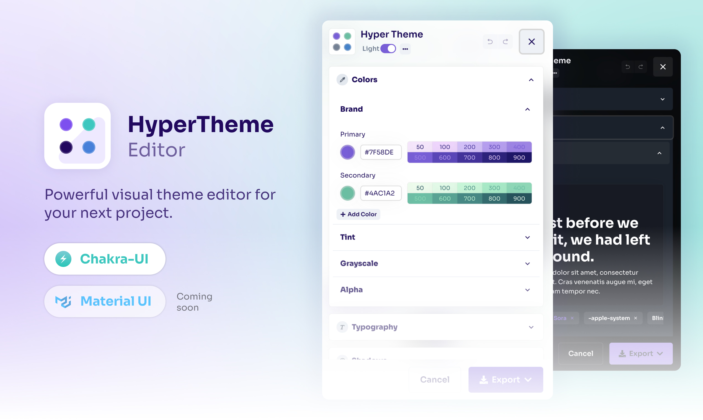

# HyperTheme Editor (Release Candidate)



Powerful visual theme editor for your next Chakra UI project.

## Features

- Chakra-UI Theme Foundation Color Editor
- Chakra-UI Theme Foundation Font Sizes Editor
- Undo/Redo
- Customizable Editor Drawer
- Custom Panel Editors
- Unlimited exports


## PRO Version

HyperTheme Editor has also an extended version with more features:
- Font Family Editor from Google Fonts
- Line Heights Editor
- Letter Spacing Editor
- Shadows Editor
- Radii Editor
- Spacing Editor

Check out more [here](https://hyperthe.me)

## Basic Setup
### 1. Installation

Install with NPM:

```bash
npm i @hypertheme-editor/chakra-ui@rc
```

or with Yarn:

```bash
yarn add @hypertheme-editor/chakra-ui@rc
```

### 2. Basic setup

Installation is super easy and fast:

- Add the component `<ThemeEditorProvider />` just below the `<ChakraProvider />` component.
- Add the component `<HyperThemeEditor />`.

Here's an example:

```jsx
import * as React from 'react'
import { ChakraProvider } from '@chakra-ui/react'
import { ThemeEditorProvider, HyperThemeEditor } from '@hypertheme-editor/chakra-ui'
import theme from './my-theme'

function App() {
  return (
    <ChakraProvider theme={theme}>
      <ThemeEditorProvider>
        <HyperThemeEditor pos="fixed" bottom={4} right={2} />
      </ThemeEditorProvider>
    </ChakraProvider>
  )
}
```

### 3. Enjoy

Enjoy! You now have an inline editor in your project.
